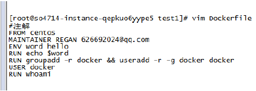
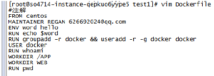
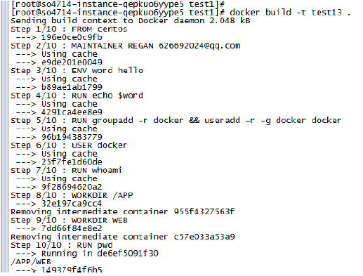

## 1.4 Dockerfile中的指令

Dockerfile中包括FROM、MAINTAINER、RUN、CMD、EXPOSE、ENV、ADD、COPY、ENTRYPOINT、VOLUME、USER、WORKDIR、ONBUILD等13个指令。

### 1.4.1 FROM

格式为FROM image或FROM image:tag,并且Dockerfile中第一条指令必须是FROM指令，且在同一个Dockerfile中创建多个镜像时，可以使用多个FROM指令。

### 1.4.2 MAINTAINER

格式为MAINTAINER user_name user_email，指定维护者信息  

### 1.4.3 RUN

格式为RUN command或 RUN ["EXECUTABLE","PARAM1","PARAM2".....],前者在shell终端中运行命令，/bin/sh –c command，   
例如：

    /bin/sh -c "echo hello"；

后者使用exec执行，指定其他运行终端使用

    RUN["/bin/bash","-c","echo hello"]
 
 
每条RUN指令将当前的镜像基础上执行指令，并提交为新的镜像，命令较长的时候可以使用\来换行。

### 1.4.4 CMD

支持三种格式：  

* 使用exec执行（推荐方式）

    CMD ["executable","param1","param2"]

* 在/bin/sh中执行  

    CMD command param1 param2

* 提供给ENTERYPOINT的默认参数

    CMD [“param1","param2"]

CMD用于指定容器启动时执行的命令，每个Dockerfile只能有一个CMD命令，多个CMD命令只执行最后一个。若容器启动时指定了运行的命令，则会覆盖掉CMD中指定的命令。  

### 1.4.5 EXPOSE  

格式为 EXPOSE port [port2,port3,...],例如EXPOSE 80这条指令告诉Docker服务器暴露80端口，供容器外部连接使用。在启动容器的使用-P，Docker会自动分配一个端口和转发指定的端口，使用-p可以具体指定使用哪个本地的端口来映射对外开放的端口。  

### 1.4.6 ENV

格式为：EVN key value 。用于指定环境变量，这些环境变量，后续可以被RUN指令使用，容器运行起来之后，也可以在容器中获取这些环境变量。  

例如：

    ENV word hello
    RUN echo $word
 
运行

    docker build -t test11 
 
### 1.4.7 ADD  

格式：

    ADD src dest

该命令将复制指定本地目录中的文件到容器中的dest中，src可以是是一个绝对路径，也可以是一个URL或一个tar文件，tar文件会自动解压为目录。  

### 1.4.8 COPY  

格式为：COPY src desc
复制本地主机src目录或文件到容器的desc目录，desc不存在时会自动创建。

### 1.4.9 ENTRYPOINT

格式有两种：
ENTRYPOINT ["executable","param1","param2"]
ENTRYPOINT command param1,param2 会在shell中执行。  
用于配置容器启动后执行的命令，这些命令不能被docker run提供的参数覆盖。  
和CMD一样，每个Dockerfile中只能有一个ENTRYPOINT，当有多个时最后一个生效。  

### 1.4.10 VOLUME  

格式为 VOLUME [“/data"]  
作用是创建在本地主机或其他容器可以挂载的数据卷，用来存放数据。  

### 1.4.11 USER

格式为：USER username  
指定容器运行时的用户名或UID，后续的RUN也会使用指定的用户。要临时使用管理员权限可以使用sudo。在USER命令之前可以使用RUN命令创建需要的用户。  
例如：  

    RUN groupadd -r docker && useradd -r -g docker docker

1.4.12.	WORKDIR
格式： WORKDIR /path
为后续的RUN CMD ENTRYPOINT指定配置工作目录，可以使用多个WORKDIR指令，若后续指令用得是相对路径，则会基于之前的命令指定路径。

## 1.4.13 ONBUILD

格式ONBUILD [INSTRUCTION]  
该配置指定当所创建的镜像作为其他新建镜像的基础镜像时所执行的指令。例如下面的Dockerfile创建了镜像A  

    ONBUILD ADD . /app
    ONBUILD RUN python app.py

则基于镜像A创建新的镜像时，新的Dockerfile中使用from A 指定基镜像时，会自动执行ONBBUILD指令内容，等价于在新的要构建镜像的Dockerfile中增加了两条指令  

    FROM A
    ADD ./app
    RUN python app.py

创建好Dockerfile之后，通过docker build命令来创建镜像，该命令首先会上传Dockerfile文件给Docker服务器端，服务器端将逐行执行Dockerfile中定义的指令。通常建议放置Dockerfile的目录为空目录。  
另外可以在目录下创建.dockerignore文件，让Docker忽略路径下的文件和目录，这一点与Git中的配置很相似，具体可以参考http://edu.51cto.com/center/course/lesson/index?id=203244免费视频。  
通过-t 指定镜像的标签信息。  
例如：

    docker build -t regenzm/first_image .

"."指定的是Dockerfile所在的路径。
